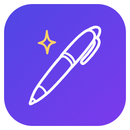
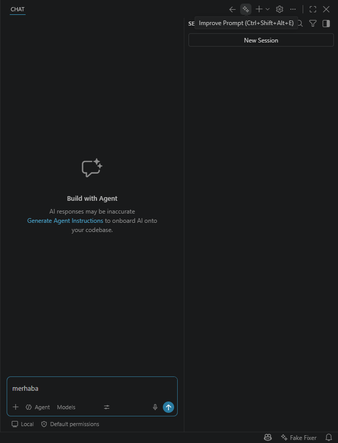

<p align="center"></p>

# PromptPen – Prompt Enhancer for Copilot Chat

Fix typos, contradictions and unclear wording in the prompt you are about to send to VS Code chat — **in place, in the chat input**, with a language model you choose. Every version is kept, so you can step back to your original at any time.

*[Türkçe açıklama aşağıda](#türkçe)*



## Why

Coding agents are sensitive to how a request is written. Controlled studies report that ambiguous, incomplete or contradictory task descriptions reduce code-generation pass rates by roughly 20–40% ([arXiv:2507.20439](https://arxiv.org/abs/2507.20439)), and that character-level typos hurt more than paraphrases ([arXiv:2506.10204](https://arxiv.org/abs/2506.10204)). Asking the developer about ambiguities before generating code measurably helps ([ClarifyGPT, FSE 2024](https://arxiv.org/abs/2310.10996)), and prompts rewritten by one model transfer to another ([Rephrase and Respond](https://arxiv.org/abs/2311.04205), [BPO, ACL 2024](https://arxiv.org/abs/2311.04155)). At the same time, heavily "engineered" prompts give little or nothing on modern reasoning models ([TOSEM 2025](https://arxiv.org/abs/2411.02093)).

So PromptPen defaults to **minimal, intent-preserving edits** and **asks instead of guessing**.

## Features

- **✨ Improve Prompt** in the chat title bar, in the status bar menu and via `Ctrl+Alt+Shift+E` (`Cmd+Alt+Shift+E` on macOS) while the chat input has focus.
- **Two modes**
  - **Fix** (default): spelling, grammar, broken sentences; vague references are resolved only when the workspace makes them certain. Adds no new requirements.
  - **Expand**: additionally names relevant files and symbols, states the expected outcome and acceptance criteria, and splits multi-part requests.
- **Clarifying questions**: contradictions and ambiguities become multiple-choice questions; your answers are written into the prompt.
- **Version history**: `←` / `→` buttons (or `Alt+PageUp` / `Alt+PageDown`) move between the original and every improved version. Text you type yourself is kept as its own version. `Ctrl+Z` works too.
- **Compare with Original** opens a diff.
- **Safe by construction**: `#file:` references, `@mentions`, `/commands`, URLs and code are verified to survive verbatim; if the model changes them, your prompt is left untouched.
- **Your model**: any model in VS Code chat — GitHub Copilot's models or ones you added (Ollama, Anthropic, OpenAI, … via *Chat: Manage Language Models*). Small, fast models are usually enough.
- **Workspace context**: active file and selection, open files, problems, Git status and `AGENTS.md` / `CLAUDE.md` / `copilot-instructions.md`. Optionally the last turns of the current chat session.
- English and Turkish UI.

## Usage

1. Type a prompt in the chat input.
2. Click **✨** in the chat title bar (or press `Ctrl+Alt+Shift+E`). The first time, pick a model; VS Code asks once whether PromptPen may use it.
3. Review the result. Use `←` to go back to your original, `→` to return, or answer the questions PromptPen asks.
4. Send the prompt as usual.

> **Where is the button?** VS Code does not let extensions add buttons next to the microphone in the chat input yet. Its only public menu inside the input (`chat/input/status`) currently drops extension commands, so PromptPen uses the chat title bar. When the chat side bar is narrow, VS Code moves the button into the `⋯` menu so that *New Chat* stays visible; the keyboard shortcut and the status bar menu always work.

## Settings

| Setting | Default | Description |
| --- | --- | --- |
| `promptpen.model` | – | Model as `vendor/id`; use **PromptPen: Select Model…** |
| `promptpen.mode` | `fix` | `fix` or `expand` |
| `promptpen.outputLanguage` | `same` | `same` as the prompt, or `en` |
| `promptpen.askQuestions` | `true` | Ask about contradictions and ambiguities |
| `promptpen.context.workspace` | `true` | Send workspace context |
| `promptpen.context.chatHistory` | `false` | Send the last turns of the current chat session (reads VS Code's internal local chat logs) |
| `promptpen.context.maxChars` | `12000` | Upper bound for context size |
| `promptpen.showSummary` | `true` | Summary of changes in the status bar |
| `promptpen.statusBar` | `true` | Show the model in the status bar |

## Privacy

PromptPen has no server and no telemetry. Your prompt and the context enabled in the settings are sent only to the model you selected, through VS Code's language model API.

## Development

```bash
npm install
npm run test:unit          # vitest
npm run test:integration   # launches VS Code with a fake model and drives the real UI
npm run package            # builds promptpen-<version>.vsix
```

Press `F5` to start an Extension Development Host. There, **PromptPen: Run Eval (development)** runs [`eval/cases.json`](eval/cases.json) (40 Turkish/English prompts with typos, contradictions, ambiguities and protected tokens) through the selected model and reports intent preservation (LLM judge), question behaviour, token preservation and length ratio.

## Türkçe

PromptPen, VS Code chat'e göndermek üzere olduğun promptu **chat kutusunun içinde** düzeltir: yazım hataları, çelişkiler ve anlatım bozuklukları. Hangi modelin kullanılacağını sen seçersin. Her sürüm saklanır, orijinaline her an dönebilirsin.

- **✨ Promptu İyileştir**: chat başlık çubuğunda, durum çubuğu menüsünde veya chat kutusundayken `Ctrl+Alt+Shift+E`.
- **Düzelt** modu (varsayılan) asgari düzeltme yapar, yeni gereksinim eklemez. **Geliştir** modu çalışma alanı bağlamıyla dosya ve sembol isimleri, beklenen sonuç ve kabul kriterleri ekler.
- Çelişki ve belirsizlikler **çoktan seçmeli sorulara** dönüşür, cevapların prompta yazılır.
- `←` / `→` (veya `Alt+PageUp` / `Alt+PageDown`) ile orijinal ve iyileştirilmiş sürümler arasında gezersin. Elle yazdıkların kaybolmaz, `Ctrl+Z` de çalışır.
- `#file:` referansları, `@mention`'lar, `/komut`'lar, URL'ler ve kod aynen korunur. Model bunları bozarsa promptuna dokunulmaz.
- Model olarak VS Code chat'teki herhangi bir model kullanılabilir: Copilot modelleri veya *Chat: Manage Language Models* ile eklediğin Ollama, Anthropic ve benzerleri. Küçük ve hızlı modeller genellikle yeterlidir.
- Sunucu yok, telemetri yok. Veri yalnızca seçtiğin modele gider.

> **Buton neden mikrofonun yanında değil?** VS Code, eklentilerin chat kutusunun içine buton eklemesine henüz izin vermiyor. Kutunun içindeki tek açık menü (`chat/input/status`) şu an eklenti komutlarını çalıştırmıyor. Bu yüzden buton chat başlık çubuğunda. Kenar çubuğu darken VS Code butonu `⋯` menüsüne taşır; kısayol ve durum çubuğu menüsü her zaman çalışır.

## License

[MIT](LICENSE)
